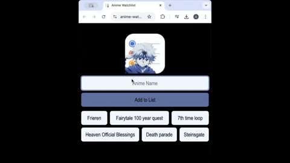
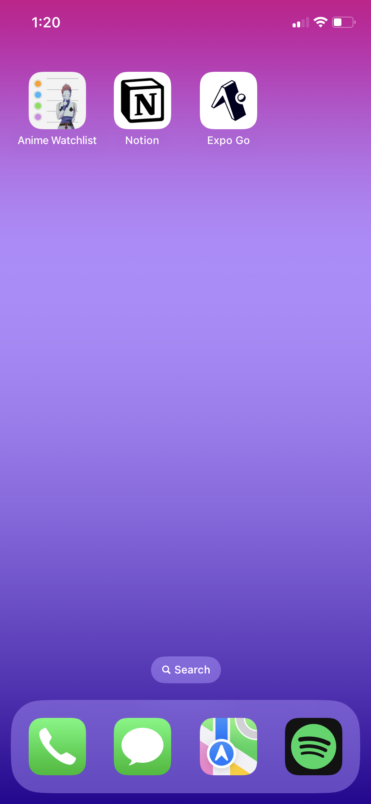
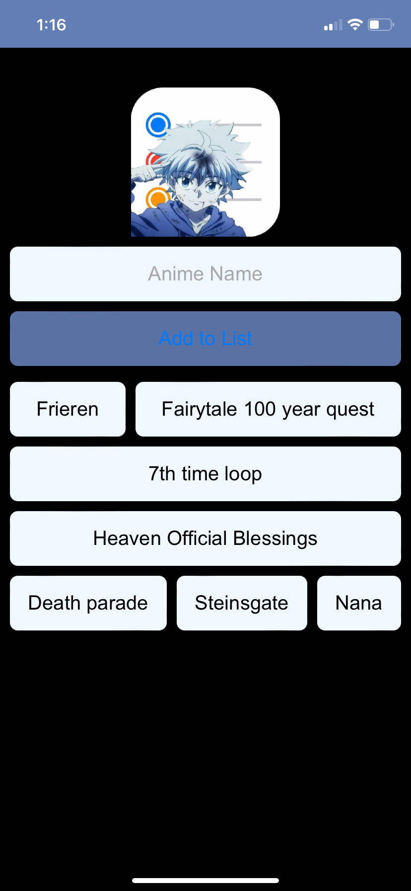
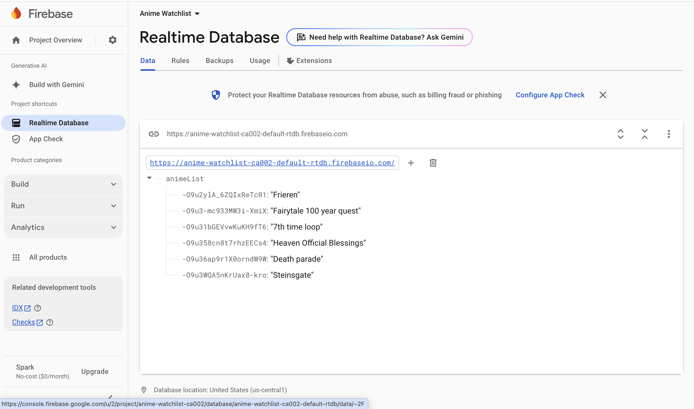

# Anime Watchlist Mobile App<br />

This mobile app allows users to create and manage a list of anime they are interested in watching in the future. The app can be shared with friends and family, enabling everyone to contribute to the list and suggest new anime to watch together. The app's database was built using Realtime Firebase to support real-time updates, and it was deployed using Netlify. Netlify enables developers to transform web apps into mobile-friendly progressive web applications (PWAs), enhancing the user experience across devices.


 <br />

## <a name="technologies"></a> Technologies
* JavaScript
* CSS
* HTML
* Firebase 
* Netlify


## How It Works

The Anime Watchlist app connects to Firebase using `initializeApp` and creates a reference to the `"animeList"` node, which stores all anime entries.

- Users can add anime titles, which are saved with **unique keys** using Firebase’s `push` method.
- The UI updates automatically whenever data is added or removed, thanks to Firebase’s **`onChildAdded`** and **`onChildRemoved`** listeners.
- Anime entries can be deleted precisely using the `remove` method, combined with `data-key` attributes on DOM elements.

## Key Features

- Built entirely with **native JavaScript** (no frameworks).
- Uses modern **ES6 module syntax** to import Firebase directly from Google’s CDN.
- Handles user interactions via `addEventListener` and DOM manipulation (`createElement`, `appendChild`, etc.).
- Input validation ensures **empty titles cannot be added**.
- Promise-based error handling (`.then()` / `.catch()`) for Firebase operations.
- Fully **real-time**: changes are instantly reflected across all connected devices.

## Code Organization

- Firebase configuration, DOM selection, event handlers, and database functions are kept in **separate blocks** for clarity.
- Initialization runs on `DOMContentLoaded` to ensure all elements are ready before scripts execute.

## Difficulties

When updating the code, the original approach used **`onValue`** to listen for changes to the entire list.  

- This caused issues where the **“Add” button could get stuck in the “Adding…” state**.  
- Input fields were **not clearing consistently** after adding a title.  

Switching to **`onChildAdded`** and **`onChildRemoved`** solved these problems because these listeners handle **individual child nodes** instead of the entire list.  

- Updates became more **granular, faster, and less prone to UI glitches**.


### Anime Watchlist App Icon on an iPhone<br />
 <br/>


### Anime Watchlist App Opened on a iPhone <br />
 <br />


### Realtime Firebase Database <br />
 <br />


## <a name="installation"></a>Installation
To run download app on you mobile phone:

#### iPhone<br />
For iphone copy URL into Safari:
```
https://anime-watchlist-sac.netlify.app
```

Click on the share button.
Next, click Add to Home Screen near bottom of page

Set display name:
```
Anime Watchlist
```

Click Add and the app should now be on the phone and ready to use. 


#### Android<br />
For Android copy URL into Google Chrome:
```
https://anime-watchlist-sac.netlify.app
```

Click on the three vertical dots int he upper right corner.
Next, click Add to Home Screen near bottom of page. 

Keep the below display name:
```
Anime Watchlist
```

Click Add and the app should now be on the phone and ready to use. 
